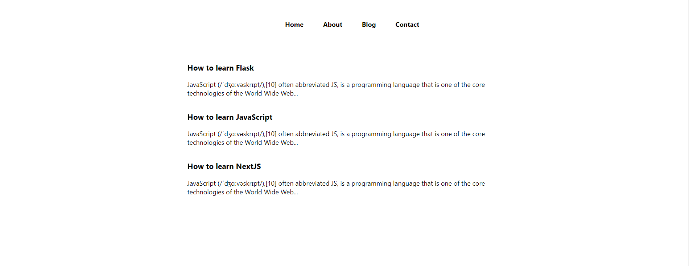

# learn_nextjs

## STEP.1:- INSTALLATION SETUP YARN , NEXTJS APP
-- Our first Next.js website
In this lesson, we will start building our first Next.js application. You will see how easy it is!

You can always use npm to install packages, but I want you to resist the inertia and start working with yarn for a while (Its fast, its worth it, I promise!)

Install yarn using this command:  
>>> npm install --global yarn

-- Creating your first Next.js app :- 
You can create your first Next.js application by running the following command:
 >>> yarn create next-app
 It will ask few questions as below
 success Installed "create-next-app@13.5.4" with binaries:
      - create-next-app
✔ What is your project named? … nextjs_learn
✔ Would you like to use TypeScript? … No / Yes
✔ Would you like to use ESLint? … No / Yes
✔ Would you like to use Tailwind CSS? … No / Yes
✔ Would you like to use `src/` directory? … No / Yes
✔ Would you like to use App Router? (recommended) … No / Yes
✔ Would you like to customize the default import alias (@/*)? … No / Yes
Creating a new Next.js app in /home/l910009/Documents/workspace/learn_nextjs/nextjs_learn.

This command will ask you a few basic questions (the name of your app, etc.) and will create a folder with your next.js app inside of it.

You can open the generated Next.js code in the editor of your choice. I am using VS Code.

-- A glance into the generated code
Create next app generates a bunch of useful files with a git repository initialized. You will also see some files some of which are discussed below:

lock – This is the yarn lock file which stores all the packages with version numbers installed inside the node_modules
.gitignore – A file that stores what is ignored by the git version control system
public folder – Contains the public directory of our Next.js web application. Anything put inside this folder will be publicly accessible on the web application’s server. Developers should avoid putting secret files inside this folder as they can easily be accessed by public users!
pages folder – Pages (which are essentially React components) following the file-based routing approach (more on this in the later lessons)
styles folder – Contains the CSS styles for the Next.js web application
 

-- Starting the server
If you look into the package.json file, you will find a script to run the development server. Open your terminal and run the following command:
>>> yarn run dev

This will start the development server. Open the URL http://localhost:3000 (the URL shown in the terminal) by pressing control and clicking on it

Congratulations you have just started your first Next.js app. In the next lesson, we will learn how to customize this app to our liking. This will include changing the existing index.js page, adding more pages, adding styles, etc.

## STEP-2 File Based Routing in Next.js

In the last lesson, we built our first Next.Js application. This lesson will focus primarily on the file-based routing provided by Next.Js. Before we dive deep into the file-based routing, I will answer a few of the most asked questions by beginners

Next.Js FAQs
Is Nextjs a Frontend or a Backend Framework?

Its both, it can generate a frontend bundle along with APIs which are run on the server.

Is NextJs better than React?

No, and Yes! React is raw and Next.js comes with a few more features on top of that like file-based routing, Server-Side Rendering (SSR), Static Site Generation (SSG), a built-in router, etc.!

 

-- File-Based Routing
While using react, we need to install a third-party package to get the routing

Next.js comes built-in with an incredible feature called file-based routing. This feature enables Nextjs developers to simply create files inside the pages folder and those files will serve as routes for the application. For example, if you create 3 files (about.js, contact.js, and index.js) inside the pages folder of your Next.js application, you can view these components by visiting localhost:3000/about, localhost:3000/contact, and localhost:3000/ respectively.

This is what file-based routing is essentially about! When a file is added to the “pages” directory, it's automatically available as a route.  Each page exports a react component which is rendered when the corresponding URL is visited by the person visiting the page!

A sample about page (component) will look something like this:

>>>
function About() {
  return 
About

}

export default About

Visiting http://localhost:3000/about will display “About” on the screen as this component returns a 
 with “About” inside of it!

 

-- Nested Routes
To create nested routes in Next.js, all we need to do is to create corresponding nested folders. For example, If you want to create a route at localhost:3000/about/one , all you need to do is to create a folder named “about” with a component named “one.js”

-- Dynamic Routes
Defining routes as shown in the Nested Routes section above is not always enough for complex applications. In Next.js you can add brackets to a page ([sno]) to create a dynamic route (or URL slugs).

Consider the following page pages/blog/[sno].js:

>>> 
import { useRouter } from 'next/router'

const Post = () => {
  const router = useRouter()
  const { sno } = router.query

  return 
Post: {sno}

}

export default Post

This page will render Post: 1 when you visit http://localhost:3000/blog/1 and the same page will render Post: 34 when you visit http://localhost:3000/blog/34

## HUNTING CODER
BRANCH:- 03_01_hunting_coder_app_setup
 Head and Script Component in Next.js | NextJs Tutorial for Beginners #6
Regardless of whichever framework or library you use, the basics and essence of HTML, CSS and JavaScript remains intact well within your needs. You have the clarity of their applications and you know that the Head tag contains the title and the styling for the page but that is when you use core HTML. There might be times when you want to write stuff in the Head tag, but find yourself stuck in Next Js where there are pages which export React components which we write and there is no Head.

For your sake, let me tell you that Next Js can do wonders for you. Next Js provides a Head component which lets you inject stuff in Head and change things like title of the page directly from the title tag present in the Head component. Due to this very ability of Next Js, we can enjoy the new, great features of Next Js while still using the good old HTML, CSS, and JavaScript. 

 

Let’s now see how it actually works.

 

-- next/Head
As a part of the previous tutorial, we started creating a blogging website named Hunting Coder. We created the applications with a very minimal change in its content. Open the same folder where you created the hunting coder application.

If you could carefully observe the default template of the application and visit the index.js page, you would find an import named Head from next/head. If that import were assumed to be removed, you would get an error to see. And this is because the default template of the application uses the Head component and features an executable program in it.

<Head>
        <title>Hunting Coder</title>
        <meta name="description" content="Generated by create next app" />
        <link rel="icon" href="/favicon.ico" />
</Head>
 

The Head component contains the title tag which for our website has Hunting Coder written in it and this gets reflected on the browser’s title bar.  We could have used JavaScript instead of Next if we had been using React, but Next gives us the convenience of injecting elements directly into the Head. Using this, you can add a custom title, CSS and any meta tags within the head component of your web page as per your requirements. 

 

Some meta tags popularly used are,

Description - This meta tag is used to define the description of the webpage.
Keywords - This meta tag is used to define keywords for search engines.
 

The first thing was this. The other thing is that we can even inject external scripts into our programs by including them in the Head component, whether it is for Google Analytics or Search Console or anything. This is done using the 
 

Now this Script component features several attributes and one of them being the strategy. This is used to set the loading priority of external scripts improving the loading performance of websites. By default, strategy is set to afterInteractive which means the scripts are loaded immediately after the page becomes interactive. But for heavy third-party scripts, we prefer lazyOnload. This enables the scripts to get loaded only after everything else is rendered already.

 

And that's how using scripts inside Head differs in functionalities from using a separate Script component. With this, we have configured both our Head and our Script components. You will soon see how these components are utilised in our programs. We’ll see the Image component in the next tutorial. 

-- Image Component in Next.js 
In the last lecture, we dealt with the Head and the Script components of Next Js. Today, we'll look at the Image component. At times, when you use HTML, CSS, or JavaScript or any other framework, it can happen that when you embed an image into your programs, you complain about it taking forever to load on the website because of the size of the image. As a result, your site runs slower and your search engine optimization is ruined.

As for Next Js, it has improvised on this front too. Next Js provides an Image component. Image component automatically optimises your images. By default, images in this component are lazy loaded. As a result, the loading time of the website is greatly reduced since only images in the viewport - that is, on the screen - get rendered and not those that are not visible to you. It is through tools like these that Next Js is strengthened. Now let's take a closer look at the Image component.

 

Next Js Image Component
Open the same folder where you have created the hunting coder application. The default template of the application contains an import named Image from next/image in the index.js file similar to what we studied in the Head component. 

import Image from 'next/image'
 

Now, let me tell you what this Image component does.

It provides you with optimised images.
By default, images are lazy loaded which means that images which are not visible to you or are not there in your viewport would not get loaded.
Helps you make your images responsive conveniently.
 

There are a number of attributes this Image component comes with. We’ll discuss some of the most used and important ones. So, let’s start with running the development server.

yarn dev
 

You must find a default card set on the website. I’ll remove them first since I don’t need them to be there on my website. I’ll start by creating a 
 element having className blogs. This holds my list of blogs. Inside this 
 element, there is a heading named Popular Blogs. create another 
 element having className blogItem. This holds my individual blog post. Each blog would contain a heading <h1> and a paragraph 
 associated with it. So, the structure of the blog page would be something like this.

        

          <h2>Popular Blogs</h2>
          

            <h3>How to learn JavaScript in 2022?</h3>
            
JavaScript is the language used to design logic for the web

          

          

            <h3>How to learn JavaScript in 2022?</h3>
            
JavaScript is the language used to design logic for the web

          

          

            <h3>How to learn JavaScript in 2022?</h3>
            
JavaScript is the language used to design logic for the web

          

        

 

Each of these blog items would get displayed using a loop. We will add our css in some later part of the tutorial. For now, we are planning out things we want to have on our website. It would also be handy to have a navigation bar on our website for convenience in browsing pages. So, let’s just get ourselves a nav component which is very easy to integrate.

 

Adding a Nav Component
First of all, add a <nav> element in the index.js file. Add a <ul> tag with for list elements inside the <li> tags namely Home, About, Blog and Contact. Here’s what the code looks like.

      <nav>
        <ul>
          <li>Home</li>
          <li>About</li>
          <li>Blog</li>
          <li>Contact</li>
        </ul>
      </nav>
 

But this surely doesn't appeal to us as a navigation bar. We would need to define a CSS styling for it to look like one.

 

Styling the nav component
Give a className to the nav component, say, mainnav. So, this goes as {style.mainnav} Since we don't want every similar component to have the same styling, defining a className is helpful.

Now move on to the main CSS file Home.module and add the CSS snippet provided below.

 

.mainnav ul{
  display: flex;
  justify-content: center;
    margin-top: 50px;
}
 
.mainnav ul li{
  margin: 0 24px;
    list-style: none;
    font-weight: bold;
}  
We have changed our navigation component to a flexbox and with some proper coherent margins and paddings, it has come out well. Update the styling of the main component to the one given below.

 

.main {
  min-height: 100vh;
  flex: 1;
  display: flex;
  flex-direction: column;
  justify-content: center;
  align-items: center;
  justify-content: flex-start;
  padding-top: 3rem;
}
We're now ready to proceed. This was our navigation component. We could have done more styling of the components but that is not our main focus here for now. We have done just enough of them to proceed. The final home page somewhat looks like this.

-- Creating Multiple Pages in Next.js
In the last lecture, we dealt with the Image component and gave our blogging website a navigation bar having links to the different pages. Basically, HuntingCoder is a blog site that will have a lot of posts and users will be able to access our website through various links and there would be multiple pages, say, a contact page, an about us page, or even a custom service page where you could offer your freelancing services in content writing and stuffs. So, today, we will learn how to create multiple pages for a website using Next Js.

 

Another thing we should take care of is that we shouldn’t hard code our contents for a website. It is a bad idea to use hard coding for websites that have a lot of content and that is where the need for dynamic navigation arises. We’ll see how all that is done in the coming tutorials. For now, we will configure the whole structure of our website, so we can see which link leads to which webpage. If you could remember, this was done using a package named React Router DOM in React, which I believe is too painful to use to render different components using different URLs. And Next Js makes it a cakewalk for us. Here, we have a pages folder where we could create our JS components and endpoints get automatically created on the basis of the names of those JavaScript files.

 

So, let’s just get started with creating these components.

Building the structure of the website
We need to change the default structure of the page in order to be able to navigate between multiple pages. First of all, run the development server if it's not running already. You must know the commands by now.

So, once opened, you could see that the website lacks even some of the basic attributes. Blog titles are static while they should be links to the blogpost and there are no pages as per mentioned in the navigation bar, and a few other things. And if you could remember, creating a page in Next Js is as simple as creating another file in the pages folder. 

 

-- Creating the About, Contact and the Blog page
Move onto the pages folder and create a JavaScript file named about.js. Build a React arrow function export component, shortcut for which in VS Code is rafce. Inside the return statement is a 
 element with a demo text as shown below. 

import React from 'react';
 
const About = () => {
    return 
This is my about component
;
};
 
export default About;
Code Snippet 1: The About component

 

This was our About component which you could see on http://localhost:3000/about. 

Similarly, create files contact.js and blog.js. Both will have the exact same components. Follow the snippets given below for each of them.

import React from 'react';
 
const Contact = () => {
    return 
This is contact page
;
};
 
export default Contact;
Code Snippet 2: The Contact component

 

import React from 'react';
 
const Blog = () => {
    return 
This is Blog home page
;
};
 
export default Blog;
Code Snippet 3: The Blog component

 

These pages should be visible to you on http://localhost:3000/contact and http://localhost:3000/blog respectively. 

 

-- Creating the blogpost folder
Now, for displaying the blog posts, we will first create a folder named blogpost in the same pages folder. Inside this folder, create a file named [slug].js. Since, each blog post will be displayed dynamically, their routes should be dynamic as well. Build a React arrow function export component similar to what we did above and import useRouter from next/router.Now, any string that comes after blogspot in the URL will be passed as a query in the form of a slug variable. You can store this using router.query as shown in the snippet below.

import React from 'react';
import { useRouter } from 'next/router'
 
const slug = () => {
    const router = useRouter();
    const { slug } = router.query;
    return 
{slug}
;
};
 
export default slug;
Code Snippet 4: The Blogpost slug component

 

As we have directly processed the slug variable here and we are returning it as is, whereas, in practice, we would seek out the API or utilise the backend. But, you have got the point how we utilise useRouter and do destructuring. For now, these were the only pages we wanted to add on our website. We’ll see if we would need more in the future, and this is where we finish giving structure to our website.

## Link component in Next.js - Understanding next/link

In the last lecture, we saw how we create multiple pages just by creating files in Next Js which is also called the file based routing method and that is what we discussed even in the first few lectures. Moreover, we gave structure to our website, although we haven't linked those pages yet. Remember that navigation of pages in React Js can sometimes be a real pain? Well, not any more now that Next Js is here. This is where the Link component comes in. So today, we’ll see how the Link component works. And not only that, we will also see how this Link component is different from the good old anchor tag of HTML which can still be used to link different websites.

First of all, run the development server if it’s not already running. Once the server starts running, you can see our website and everything we have done so far. Also, we have created all the required pages for our website. Despite this, the biggest problem with the website is that these pages are still not navigable. And we cannot simply use anchor tags to achieve that here. We will rather use the Link Component.

 

Link Component
When you use anchor tags to link your website pages, clicking the website reloads the page, whereas using Link for the same purpose avoids the triggering of the page refresh. And this is because there is no href but JavaScript is populating the content of the linked page. So basically, that’s the beauty of the Link component of Next Js. It prevents the web page from reloading each time you click a navigation link.

Link is a component which can be easily imported from next/link using the command given below.

import Link from 'next/link'
 

Now, since we want the contents of our navigation bar to handle links to different pages, we would nest the list items into the Next Js Link component. Link component has an only required attribute named href which holds the relative link to the page you want to navigate from this Link. We have placed these list items inside an anchor tag to make them appear as links. This is how the updated code looks like.

<ul>
          <Link href='/'><a><li>Home</li></a></Link>
          <Link href='/about'><a><li>About</li></a></Link>
          <Link href='/blog'><a><li>Blog</li></a></Link>
          <Link href='/contact'><a><li>Contact</li></a></Link>
        </ul>
 

And as you can observe, we can now navigate to different pages through these links. 

The Link component also has other useful and complex attributes, such as scroll, which lets us decide whether to scroll the page all the way to the top or not while navigating. More information about the Link component can be found on its official Next Js documentation page.

## Component Level CSS in Next.js 

In the last lecture, we dealt with the Link component of Next Js and we saw the differences between the Link component and the good old anchor tag of HTML. It may often be the case that you want one component of your website to use one CSS and another component of your website to use another CSS. So today, we'll go over how you can make that happen, as well as why you might want to learn this if you haven't already felt the need of doing this Component based styling of your site. Let’s just get started.

CSS is one of the most important elements that give your website the appearance it demands, and the way we exploit it here would give Next Js a greater impact on popularity as a framework and it manages the styling of the website so well. So, let’s first open VSCode in the parent directory. Run the development server, if not running already. 

 

If you could remember, we had put some styling in our website earlier using the className {styles.container} or {styles.mainnav}. Today, we'll look at how they work and how we can manipulate them to serve our purposes. Next JS allows you to utilise component level CSS. If you could observe the styles folder, there is a file named Home.module.css which is nothing but a simple CSS file. And this file can easily be imported into our pages as we have already done in index.js.

import styles from '../styles/Home.module.css'
 

Once imported, styles becomes an object and is no more a styling component. To understand how this exactly works, we would put this styles object as an output in the console and see its content. 

 

As you can see, there is one key relevant to each of the classes we have in Home.module.css and corresponding to each of those keys is a unique value. And that unique value is such that there is no collision with any other such key value pair.  Now, suppose we have another CSS file and that contains a main class too. So, this is where defining a CSS as an object helps distinguish the styling you want to use in that particular component. The main class of the CSS you would have imported will be considered. So, what exactly happened is, that when you defined your className as styles.container, Next Js looks for the definition of the object and matches which CSS file this object represents. Once that is determined, Next Js finds the class you added.

 

Consequently, Next Js ensures that the stylings you include do not conflict with each other. Suppose there is one CSS file named Home1.module.css and one another CSS file named Home2.module.css and both these files contain a class named con with different background colors. Now, import them as shown in index.js.

import styles1 from '../styles/Home1.module.css'
import styles2 from '../styles/Home2.module.css'
 

Now, we’ll give this styling to one of the blocks in the home page, say, to the blogs block. 

 

This makes the whole block red as shown in the figure and the unique code corresponding to this styling is Home1_con__ggzJM.

Image 1: Home Page corresponding to the first styling

Giving the same block style2 makes the whole thing yellow and the unique code corresponding to the styling would be Home2_con__PEVRC.

Image 2: Home Page corresponding to the second styling

 

In that way, Next Js has made this incredibly easy to apply the styling of our choice to any component. All you have to do is simply import the CSS file, address it with an object name, and begin to use its classes. A basic pattern like that would be easy for you to remember and use without having to worry about how exactly it works if you find it too overwhelming. 

## Adding Global Styles in Next.js 

In the last lecture, we saw how easy Next Js makes it for us to use different stylings at different components. We learnt component level CSS application and the functioning of it in detail. We saw the applications of modules and how ending any CSS file with .module.css could help us using them as modules.

And as you may remember, for every Next Js application that we create, there is an in-built CSS module. And classes present in those modules only are used in the default home page of the application. But Next Js gives us the flexibility to define our own CSS and import it into any component we wish to use them in. Today we'll look at how we can structure our CSS part for the same website, Hunting Coder and how the classes involved with those CSS files can be applied efficiently.

 

In addition, we will learn how to include a custom CSS file as we did before with HTML stylesheets. So, let's first create a CSS file named style.css in the styles folder. There won't be anything complex in this but a background style for demonstration purposes. Make sure you have run the development server already using yarn dev.

body{
    background-color: red;
}
Code Snippet 1: CSS in style.css

</AD>

Now, we want to include this stylesheet into our website and that too in our index.js file. Earlier we learnt including the .module.css file using the import method and styles object. But the disappointing part is, you cannot import a stylesheet directly into your applications. In fact, even if you forcefully put the import command, you would get an error suggesting that you use the modules method to style your website.

 

The error asks you to either shift all CSS imports to the pages/_app.js  file which makes all your custom stylesheets global or simply use the Component level CSS styling. So, let’s just put this import command in the _app.js file. You would observe the changes took effect and our stylesheet has been included as soon as we followed the above command and this is because _app.js is the file which renders all your website pages.

</AD>

This red background doesn't really look great on our website, but I did it just for demonstration purposes. Furthermore, you can observe that the website does not take any time to load when you navigate between multiple pages. To provide a more concrete understanding, when you access your blog page from the home page, you can see what all things your website loads under your Networks tab. I have attached the screenshot of the same blow.

Figure 1: Network tabs when we navigate from home to blog page

 

It is evident that there are only a few things that are loaded here, each having a size of a few kilobits. This is what makes our pages load so quickly. Reloading the blog page now will show you the difference in the data being loaded now compared to when you navigated the page earlier. The size of the data rendered has become too big now.

Figure 2: Network tabs when we reload the blog page

 

Hope you understand the differences that Next JS provides over the way we used to create websites earlier. You may not have understood everything we discussed today regarding how CSS is used within Next JS and for someone just beginning, it's completely understandable. Eventually, you will get the hang of it. We will continue to revise things at times. 

To sum it up, whenever you wish to apply Component level styling, you use the .module.css extension for your CSS files and import them directly and when you wish to define a global styling, you put import your CSS file in _app/js file.

## Styled jsx in Next.js

In the last lecture, we explored how different custom stylings can be applied to our websites to make them look the way we want in different ways. Two of them were highlighted, the first one being Component level styling, and the second one was global styling.

Despite how great these technologies are, you'll always miss the simplicity of our good old HTML, CSS, and JavaScript. But Next JS lets you enjoy that convenience here as well. You can program your stylesheets targeting your classes just like you did in normal CSS even in Next Js with much more functionalities using a special syntax named style JSX. Using this makes it possible to write CSS specific to a particular component. That even makes it easier to add, change, and delete styles without worrying about how they will affect other components. You can even declare it globally following different methods. Let's just begin with style JSX without further ado.

 

First of all, run your development server using yarn dev. So far, we have discussed a lot about styling our web pages. Now, style JSX is another method to add CSS in a particular component. Suppose we consider the div element we are returning in index.js. Here, we define a style jsx tag, which is wrapped in the main div element. Inside it, we target a particular className, here mySpan, and give custom styling to it and everything inside this style jsx tag is wrapped in backticks.  Refer to the snippet below. 

      
</AD>

We have given className mySpan to the heading of the webpage Hunting Coder which is wrapped in a span tag. Using the above styling method, we have applied the font colour red to the heading. This change takes effect once the program is saved.

In turn, this enables us to implement Component-level CSS the same way we did before. For you to see how that works, let’s first create a folder named components. Create a JavaScript file named dummy since this is just for demonstration purposes. Inside the file, define a react arrow function export component, shortcut for which is rface. Make sure the function name Dummy begins with an uppercase letter. Now, define a style jsx  in the return statement of this function as we did above, but this time the target className would be dummy. Set the background colour for this class to yellow. Define a div element inside the return statement for this component, and give it a className dummy. This is the element we are giving the above styling to.

import React from 'react'
 
const Dummy = () => {
    return (
        <>
            
            
I am dummy dummy

        </>
    )
}
 
export default Dummy
 
rafce
</AD>

The above implementation produced a very obvious result, as shown below.

To sum it up, whenever you wish to apply Component level styling, you use the .module.css extension for your CSS files and import them directly and when you wish to define a global styling, you put import your CSS file in _app/js file.  That's all for this tutorial.

## Displaying Navbar on all pages 
In the last lecture, we did a bit of cleaning up of the whole website. Several files were deleted as they were redundant and unnecessary. As a result, our website now appears more professional. Currently, the navigation bar is only visible on the homepage of the website. As we navigate to other pages, such as the about page or the blog page, we only see demo texts and there is no navigation bar present there.

 

One way to achieve this would be to copy the navigation bar on those pages and change things accordingly. But, why does this process need to be tedious and redundant when we have the feature of components and we can exploit the _app.js file to our benefit? In this lesson, we'll see how we can implement a navigation bar across all pages efficiently. 

Run the development server using yarn dev from your main directory where your Hunting Coder folder is located. Now, integrating the navigation bar into all pages of our website is not that difficult, but the way we will implement it will be very useful for further applications down the road. And the file _app.js is of utmost importance to us. This file can be found in the pages folder, and you might be wondering what it looks like. Well, _app.js is different from any other page in that folder. It is the only page that gets rendered on every other page in the folder. This can be verified by putting a console log command somewhere in the MyApp function of the _app.js file. And then you could observe that every time a page is loaded, this log will appear in the console.

For now, the MyApp function returns only a component and its corresponding props. However, we would simply wrap this part of the return statement inside an empty tag, so that we can now return any other piece of information as well. And this additional piece of information could be anything ranging from a simple div element to an entire component. This is what we will exploit to add a navigation component to every page.

 

So, we'll begin by creating a new component named Navbar.js so that we wouldn't have to include the whole snippet in the return statement. Construct an arrow function export component using the shortcut rface named Navbar. Cut the nav component from the index.js file and paste it here in this Navbar component. Do necessary imports such as styles and Link. This creates a separate Navbar component. We just have to include this now in the MyApp function in the _app.js file.

 

In the _app.js file, import Navbar from its relative location. Add <Navbar/> in the return statement of the MyApp function. And we are done. The navigation bar gets installed on every page. You can see it for yourself. 

import React from 'react'
import styles from '../styles/Home.module.css'
import Link from 'next/link'
 
const Navbar = () => {
    return (
        <nav className={styles.mainnav}>
            <ul>
                <Link href='/'><a><li>Home</li></a></Link>
                <Link href='/about'><a><li>About</li></a></Link>
                <Link href='/blog'><a><li>Blog</li></a></Link>
                <Link href='/contact'><a><li>Contact</li></a></Link>
            </ul>
        </nav>
    )
}
 
export default Navbar
Code Snippet 1: Navbar.js in the components folder

 

import Navbar from '../components/Navbar'
import '../styles/globals.css'
 
function MyApp({ Component, pageProps }) {
  return (
    <>
      <Navbar />
      <Component {...pageProps} />
    </>
  )
}
 
export default MyApp
Code Snippet 2: Redefined _app.js file

 

Having added the navigation bar to each of the pages, we will now proceed to giving structure to these individual pages. The About page is something I'll let you all design by yourselves according to your preferences. We will direct our attention to blog pages and blog posts in the next tutorial. Following that would be the contact page. So, things will go at their own pace. Have patience and enjoy the tutorials. Hope to see you all there in the next tutorial where we’ll structure the blog page and posts.

## Creating Blog and Blogpost page
In the last lecture, we learnt how the _app.js file works and how important it is in terms of executing something globally. We took advantage of this feature and made the navigation bar available on every page of the website by simply creating a separate Navbar component and including it in the return statement of the MyApp function in the _app.js file. 

 

Hunting Coder is a blogging website and the primary product of our website is the content in a blog. And this content gets displayed on our blog post page which we will create in this tutorial. In addition, we will create a blog page for listing all the blogs present on our website. Our preferences will guide the design of these pages. We’ll first start with the making of the blog page followed by the blog post page that can be generated dynamically by itself for each blog on the site. 

Open the Hunting Coder folder in VSCode and start the development server using yarn dev. Once the server starts, you can see the navigation bar on each of the pages. While we begin the process of structuring our blog page, it is important to keep in mind that the blog page will be inspired by the styling of the list of blogs on the homepage.

 

Creating the Blog Page
Open the blog.js file. Remove everything that is already present in the return statement of the arrow function Blog. Copy the section handling with the list of blogs on the homepage and paste them here inside the return statement. The blog.js file would have the following content for now.

import React from 'react';
 
const Blog = () => {
    return 

        {/* 
 */}
        <h2>Popular Blogs</h2>
        

            <h3>How to learn JavaScript in 2022?</h3>
            
JavaScript is the language used to design logic for the web

        

        

            <h3>How to learn JavaScript in 2022?</h3>
            
JavaScript is the language used to design logic for the web

        

        

            <h3>How to learn JavaScript in 2022?</h3>
            
JavaScript is the language used to design logic for the web

        

    
;
};
 
export default Blog;
Code Snippet 1: Content of the blog.js file

 

Although all the elements of the homepage make their way to the blog page after what we did above, the styling of this page falls far behind. 

In order to accomplish that, we will create a separate style for the blog page. Get into the styles folder and create another file named Blog.module.css. The styling would be more or less similar to what we have on the homepage. Before we write the CSS here, import this .module.css file in the blog.js file. Since styling has never been our first priority, we’ll simply copy some of the classes from Home.module.css. Copy the main class and this should already put the whole content in the centre and with the same styling on the homepage. See the screenshot below.

We’ll now insert a Link component here to have the title for each of the blogs redirect to the blog page corresponding to it. To be able to use the Link component, make sure you have imported Link from next/link. Wrap the h3 tag inside this Link component and make it redirect to a blog post page exploiting the content of the slug. Add another class blogItemh3 in the Blog.module.css to make the cursor become a pointer when it hovers over the title of the blog. Here’s how we have changed these files.

.main {
    min-height: 100vh;
    flex: 1;
    display: flex;
    flex-direction: column;
    justify-content: center;
    align-items: center;
    justify-content: flex-start;
      padding-top: 3rem;
  }
 
.blogItemh3{
    cursor: pointer;
}
Code Snippet 2: Blog.module.css

 

import React from 'react';
import styles from '../styles/Blog.module.css'
import Link from 'next/link';
 
const Blog = () => {
    return 

        <main className={styles.main}>
            

                <Link href={'/blogpost/learn-javascript'}>
                    <h3 className={styles.blogItemh3}>How to learn JavaScript in 2022?</h3></Link>
                
JavaScript is the language used to design logic for the web

            

            

                <h3>How to learn JavaScript in 2022?</h3>
                
JavaScript is the language used to design logic for the web

            

            

                <h3>How to learn JavaScript in 2022?</h3>
                
JavaScript is the language used to design logic for the web

            

        </main>
    

};
 
export default Blog;
Code Snippet 3: blog.js

This is where we finish creating our blog page. Currently, when you click the title of the first blog, you reach a page which is supposedly the blog post page for that blog. We, now, have to structure this one.

 

Creating the Blog Page
Navigate to your blogpost folder, where the dynamic files assigned to each blog post are located. Open the [slug].js file. Clear everything written in the return statement of the slug function. Create an h1 tag for the title of the blog, followed by an hr tag for a line separating the title and the content. A div element containing the content of the blog would appear below the title. 

To style this structure, we will create a separate style for the blog post page. Get into the styles folder and create another file named BlogPost.module.css.  Copy the main class from the Blog.module.css and paste it here. Wrap everything in the return statement in a div element with class main. We would also add a container class for additional padding. This is how both the CSS and JS files look.

import React from 'react';
import { useRouter } from 'next/router'
import styles from '../../styles/BlogPost.module.css';
 
const slug = () => {
    const router = useRouter();
    const { slug } = router.query;
    return 

        <main className={styles.main}>
            <h1>Title of the page {slug}</h1>
            

            

                Lorem ipsum dolor sit amet consectetur, adipisicing elit. Dolorem nulla repudiandae sint facilis, sunt corrupti numquam id illo. Ut deserunt animi iste voluptatum!
                Lorem ipsum dolor sit amet consectetur adipisicing elit. Repellendus maxime rem earum repudiandae, cum possimus quae assumenda nulla culpa. Odit architecto repellendus non, unde recusandae placeat nisi perferendis quod nesciunt! Dolorum sapiente et sint consequuntur earum blanditiis iusto reprehenderit molestiae quia eligendi? Exercitationem, officia nobis!
            

        </main>
    
;
};
 
export default slug;
Code Snippet 4: [slug].js in the blogpost folder

 

.main {
    min-height: 100vh;
    flex: 1;
    display: flex;
    flex-direction: column;
    justify-content: center;
    align-items: center;
    justify-content: flex-start;
      padding-top: 3rem;
  }
 
  .container {
    padding: 0 22rem;
  }
Code Snippet 5: BlogPost.module.css

And this is where we finish the structuring of the blogpost page as well. This is how it looks.

We have now improved the appearance of our website. Pages are not reloading on navigation.

## Adding blog jsons as data

In the last lecture, we structured two of our website’s important pages namely the blog and the blogpost pages. The process of applying different styles to different components was evidently exemplified in the last lecture when we used the .module.css files to put styling to those two pages. 

 

The data we want to store for our website could have been stored in a separate database configured using a backend, but that would have been too complicated for a simple and beginner-friendly website like ours. In order to avoid that complexity, we will store different blog posts in different JSON files. A better and more optimised solution using databases like MongoDB or SQL will follow later on, but for now let's learn how blog posts’ content stored in JSON files could be read and displayed on Hunting Coder through the NextJs file-system. 

Run your development server. Data must be stored somewhere for it to be fetched. Currently if you open your blog page and click on the title of the first blog, it navigates to a blog page and there is some content present. That content has been hard coded into the application. And hard coding is something developers shouldn’t do for a scaled project. So, we will create a folder named blogdata in the Hunting Coder directory. This folder will store all JSON files which are to be rendered on the website. For the sake of demonstration, I'll create a few examples. 

 

Create a JSON file named how-to-learn-javascript.json. We are keeping three key value pairs for our blogs. First, the title of the blog, then the content of the blog, followed by the writer or the author of the blog. You can add some data on your own, such as the date the article was published or the category it belongs to. Put the following key value pair in the file we just created.

{
    "title": "How to learn JavaScript",
    "content": "JavaScript (/ˈdʒɑːvəskrɪpt/),[10] often abbreviated JS, is a programming language that is one of the core technologies of the World Wide Web, alongside HTML and CSS.[11] Over 97% of websites use JavaScript on the client side for web page behaviour,[12] often incorporating third-party libraries.[13] All major web browsers have a dedicated JavaScript engine to execute the code on users' devices. JavaScript is a high-level, often just-in-time compiled language that conforms to the ECMAScript standard.[14] It has dynamic typing, prototype-based object-orientation, and first-class functions. It is multi-paradigm, supporting event-driven, functional, and imperative programming styles. It has application programming interfaces (APIs) for working with text, dates, regular expressions, standard data structures, and the Document Object Model (DOM). The ECMAScript standard does not include any input/output (I/O), such as networking, storage, or graphics facilities. In practice, the web browser or other runtime system provides JavaScript APIs for I/O. JavaScript engines were originally used only in web browsers, but are now core components of some servers and a variety of applications. The most popular runtime system for this usage is Node.js. Although Java and JavaScript are similar in name, syntax, and respective standard libraries, the two languages are distinct and differ greatly in design.",
    "author": "Harry bhai"
}
Code Snippet 1: how-to-learn-javascript.json

 

Create another two JSON files namely how-to-learn-flask.json and how-to-learn-nextjs.json. Copy and paste the same content we have in how-to-learn-javascript.json in these files as well. This should be adequate to help demonstrate things. Now, we want to display these blogs on our blog page where we find a list of all the blogs present on the website.

There should be a way to retrieve the data from the blogdata folder and display them the way we wish. If you could see, there is some hard coded information in the blog.js folder. We would just have to establish a for loop that would iterate through all the files in the blogdata folder and display things we want to. Prior to proceeding right with implementing things, we will create an action plan outlining the steps we will take. It will be helpful for you to understand. 

 

These are steps we will follow to display title and description on the blog page.

First step would be to collect all the files from the blogdata directory. 
Second step would be to iterate through all the collected files and display the needed information on the blog.js page.
 

These are steps we will follow to display the content of the blog on the blogpost page.

First step would be to find the file in the blogdata directory corresponding to the slug. 
Second step would be to populate the content of the blog inside the page in the format specified.
 

At this point, we have just discussed the steps we would have to follow in order to achieve our desired result. Each of them will be covered in subsequent tutorials.

Let me know in the comments section, how you think we could accomplish the above-mentioned steps in NextJS without using any database or anything. Had the JSON files been placed in the public folder, things would have been much easier while everything could have been accessed directly but this is not the case. Users do not have access to all the files on the server, so they cannot iterate through the system and fetch the desired file. So, keep these things in mind while you look for a solution to this. Hope to see you all there in the next tutorial where we’ll start with an introduction to APIs and more. Till then, keep coding and learning!

## Introduction to API Routes in Next.js 
In the last lecture, we learnt the need of a system through which JSON files can be utilised to store the content of our blogs for Hunting Coder. We mentioned steps we would follow in the future to make it possible for our website to read data through JSON files and display them on the website. This way, we avoided the necessity of using databases for complex processing or an exclusive backend for the same. 

You may recall we discussed how Next Js is not just a front-end framework, but a backend framework as well. Let's see how we can create API routes using Next Js to prove this claim right. We will see how we can exploit the api folder in the pages folder to construct our backend for the website. As we build the backend, we will also see how API endpoints can be utilised and how request and response objects can be handled. So, let’s just get started with the introduction of APIs. 

As of now, the data files have been created. Let’s see how we can serve them. Run the development server. Now, we want to have all the JSON files present in the blogdata folder rendered and displayed on the blog page as a list and on the blogpost page when the corresponding slug is found in the query. For that, we will first have to get ourselves acquainted with the Next Js API. 

There is a folder named api in the pages folder. The rest of the files in the pages folder make up the website's front-end. We will now be looking at the website's backend which is not visible to the user. In the api folder, there is a JavaScript file named hello. Now, when you search http://localhost:3000/api/hello on your browser, you get to see {"name":"John Doe"} which is exactly what has been given by the program hello.js below. 

export default function handler(req, res) {
  res.status(200).json({ name: 'John Doe' })
}
Code Snippet 1: pages/api/hello.js

 
This is how Next JS is already a backend framework now. We can build our desired API routes utilising the file-based routing principle. In this way, Next JS serves as both a front-end and a backend framework. Changes in the returned JSON statement in this file would also get reflected on the above link. Suppose, I replace John Doe with Harry Bhai. Below is what it shows now.

So, we just want to get the requested slug via some API endpoints and then retrieve the corresponding blog content and return it via the JSON statement. Backend is something no user can access. Even if you try logging your data in the console, it won’t get displayed there. That's the level of integrity almost every backend tool maintains. Although, things you log get printed in your private server, here, on your VSCode terminal. You can do that for both request(req) and response(res) objects. 

As with how all pages get displayed according to the hierarchy they appear in the pages folder, which we call file-based routing, API routing follows the same principle. For example, create another file named index.js in the api folder. Copy the contents of the hello.js file and paste them here. Replace Harry Bhai with this is my homepage. And now, you can find this content on http://localhost:3000/api. 

We can now implement all kinds of API we wish to in the same way. Be it a get request, post request or a put request. We will use them all according to our needs in the project. That was it for now. Hope to see you all there in the next tutorial where we’ll create some endpoints for their use in the Hunting Coder

## Creating endpoints to get one/all blogposts
In the last lecture, we learnt about what APIs are in Next JS and how they are used to construct the backend of a website. We saw how easy Next JS had made it for its developers to utilize the framework for developing the backend. We learned about the API folder in the pages folder, which consists of files that build the API routes which are not shared in your client bundle.

Today, we will see how we can populate Hunting Coder with blogs and how a blog can be accessed using its slug. In addition, we'll see how accomplishing the above-mentioned tasks allows the website's frontend and backend to work together seamlessly. Basically, we wish to expose the information stored in the files in the blogdata folder via some endpoints that could be accessed by the file in the blogpost folder.

Having a basic knowledge of Node JS is not necessary for the job, but it would be nice if you did. First, rename the file hello.js that we built in the last tutorial to blogs.js. Access the file. Here, we wish to read the file system. For that, we will first clear whatever is already written inside the function. Exploring the actual documentation on reading a file in Next JS, we could find several ways to do that. One way is to use the fs module directly to interact with the file system. Import everything using a * from ‘fs’ using the command below.

import * as fs from 'fs';
Now, we could read individual files using the readFile function of fs. This function takes the path to the file as its first argument, the type of encoding system, UTF-8, as the second, and a callback function as the third. For demonstrating, we would use the how-to-learn-flask.json. file to get displayed. The callback function would first parse the data read by the readFile function into a string. Below is the snippet of the changes we made to the blogs.js file.

import * as fs from 'fs';
export default function handler(req, res) {
  fs.readFile("blogdata/how-to-learn-flask.json", 'utf-8', (err, data) => {
    res.status(200).json(JSON.parse(data));
  })
}
And now, when we reload the page at http://localhost:3000/api/blogs, we would get to see the blog data corresponding to the file we used for reading.

But, if you could notice carefully, this is not what we originally wanted. We wanted to list the blog information corresponding to each of the files present in the blogdata directory and not only the ones we hardcoded in the backend, as here, only the first one got listed. Although, this function would also come into use when fetching information about individual blogs.

So, let’s just create another JS file, getblog.js, inside the same api folder and copy the method we used above in the blogs.js file to retrieve information about a single blog from JSON files present in the blogdata folder. The function of this getblog API would be to feed the slug received from the query in the readFile function and search for a JSON file corresponding to the same slug in the blogdata folder and return its content in a JSON object format. Currently, the location of the file is hardcoded for the first JSON file. We will replace the name of the file with a variable that is nothing but the name of the file we’ll extract from the request query. We’ll also include an if statement, which will throw errors for invalid file names. Here’s the program for the getblog file.

import * as fs from 'fs';

export default function handler(req, res) {

  fs.readFile(`blogdata/${req.query.slug}.json`, 'utf-8', (err, data) => {
    if (err) {
      res.status(500).json({ error: "No such blog found" })

    }
    console.log(req.query.slug)
    res.status(200).json(JSON.parse(data))
  })
}

Code Snippet 1:  pages/api/getblog.js

So, now when we navigate to the page at http://localhost:3000/api/getblog?slug=harry, we get an error saying, no such blog found, since the slug harry is a filename that has no match in the blogdata folder.

Let’s move back to blogs.js and make it work for listing all blogs present in the blogdata folder. For this, instead of using the function readFile, we’ll make use of the function readdir. This function takes the path to the directory as its first parameter and a callback function as the second. Here’s how the blogs.js API looks now.

import * as fs from 'fs';

export default function handler(req, res) {
  fs.readdir("blogdata", (err, data) => {
    console.log(data)
    res.status(200).json(data)
  })
}
Code Snippet 2:  pages/api/blogs.js

And now, when you surf the page at http://localhost:3000/api/blogs, you’ll get to see the list of all the blogs present in the blogdata folder.

Here, we finish creating all our necessary API endpoints to retrieve different information for different purposes using the backend. Hope to see you all there in the following tutorial, where we’ll make use of these endpoints we created in the Hunting Coder. 

## Using the API Endpoints
In the last lecture, we learnt to create API endpoints using Next JS.  We created two API endpoints, one for populating the list of blogs present in the blogdata folder, and another for fetching information in JSON object format for individual blogs when requested through the request query via a slug. But only creating endpoints makes no difference to our application. For them to work, they must be incorporated into our frontend somehow.

Today, we’ll see how we can use these endpoints in our frontend and establish a connection between the frontend and the backend. We’ll strategize the calling of these API routes and much more. So, let’s just get started.

Start by launching the development server. As of right now, you'll see a list of three blogs that are hard-coded into the program when you navigate to the blog page. And when you click on the first blog’s heading, it navigates you to a dummy page that has some garbage information that we hard-coded earlier. We wish to use the blogs API here to populate the actual list of blogs present on our server and the getblogs API to fetch the actual content of the corresponding blog.

 

Recreating the blogs API for reading contents inside each blog
Currently, we only get to see the list of blogs present in the blogdata folder when we load the page at http://localhost:3000/api/blogs. But, that is not the only thing we want to read from the directory. We wish to read further the content of each of these blogs. For this, we will run a for loop iterating through all these blogs with a variable name item for each blog. Now, we’ll use the readFile function to read the content inside each of these blogs. This readFile function takes the path to the file as its first parameter and an encoding method as the second. Since we do not want to put the response here, but at the end, after reading all files, there would be no callback function. To store the content at this instant, we’ll need a variable container. So, define a container object named allBlogs at the beginning. Now, we can push the blog content into this array allBlogs and output the response containing the array once the loop has ended.

Here’s how the function looks now.

export default function handler(req, res) {

  fs.readdir("blogdata", (err, data) => {
    console.log(data)
    let allBlogs = [];
    data.forEach((item) => {
      console.log(item)
      fs.readFile(('blogdata/' + item), (d) => {
        allBlogs.push(d)
      })
    })
  })
  res.status(200).json(allBlogs)
}
Code Snippet 1: blogs API without the use of promises

 

It is possible that most of us overlooked the fact that we didn't give enough time for the program to output desired results. The array might remain empty even after the program is compiled and run successfully. We’ll use the await-async method to prevent that error. We’ll also use promises to handle the delay caused by the program to read the files.

We’ll start by making this function asynchronous. Then, store the output given by the promised readdir function in a variable named data. Create another variable named myFile which will be used to hold the content of each blog. Run a JavaScript for loop that keeps running until the whole folder is read. Within the loop, define a variable called item to hold the current file value. Define another promised readFile function and feed it the required parameters and store the value it returns in myFile. Push the parsed information from myFile in JSON format in the array allBlogs. Once the loop ends, put the response as allBlogs. Here’s how the above function needed to be changed.

export default async function handler(req, res) {

  let data = await fs.promises.readdir("blogdata");
  let myfile;
  let allBlogs = [];
  for (let index = 0; index < data.length; index++) {
    const item = data[index];
    console.log(item)
    myfile = await fs.promises.readFile(('blogdata/' + item), 'utf-8')
    allBlogs.push(JSON.parse(myfile))
  }
  res.status(200).json(allBlogs)
}
Code Snippet 2: blogs API with the use of promises

 

And now, when you reload the page at  http://localhost:3000/api/blogs, you get to see the list of all blogs along with the content of those blogs.

Using the blogs API
And now, we’ll make use of this blogs API in our front end to list the blogs on the blog page. Open the blog.js file present in the pages file. We can use useEffect Hook to fetch data from the API for our use in the frontend. Inside useEffect, use the fetch function to fetch the data from the blogs API. This fetch function returns a promise which further needs to be parsed and then returned. So, this function uses the .then method twice. Once for parsing and then for utilizing that parsed data. Define an empty state variable blogs using the useState Hook at the beginning. Set blogs to parsed.

Once this blogs state has all the parsed data, we’ll simply include this in the return statement of the Blog function using JavaScript map and the variable blogItem. We’ll add an element slug to all the JSON files to be able to use as a unique key for all blogs. Now, this blogItem could be easily used to return whatever JSX we were earlier returning, but this time, it would all be dynamic. We ensure that only an excerpt of the entire content gets displayed on the page. Here’s how the changed blog.js file looks.

import React, { useEffect, useState } from 'react';
import styles from '../styles/Blog.module.css'
import Link from 'next/link';

// Step 1: Collect all the files from the blogdata directory
// Step 2: Iterate through them and Display them

const Blog = () => {
    const [blogs, setBlogs] = useState([]);
    useEffect(() => {
        console.log("useeffect is running");
        fetch('http://localhost:3000/api/blogs').then((a) => {
            return a.json();
        })
            .then((parsed) => {
                console.log(parsed)
                setBlogs(parsed)
            })
    }, [])

    return 

        <main className={styles.main}>
            {blogs.map((blogitem) => {
                return 

                    <Link href={`/blogpost/${blogitem.slug}`}>
                        <h3 className={styles.blogItemh3}>{blogitem.title}</h3></Link>
                    
{blogitem.content.substr(0, 140)}...

                

            })}
        </main>
    

}

export default Blog;

Code Snippet 3: pages/blog.js finalized

 

We have added styling to the className blogItemp. Here's the class corresponding to that in the Blog.module.css file.

.blogItemp{
  max-width: 45vw;
}
Code Snippet 4: blogItemp styling

 

And this is what we get when we reload the page at http://localhost:3000/blog.

## Fetching BlogPost using /getblog Endpoint
In the last lecture, we recreated the blogs API for reading the contents inside the blogs and also implemented the use of the blogs API in listing all the blogs along with their content present in the blogdata folder on the blog page of Hunting Coder.

Today, we will use another API named getblog to fetch the content corresponding to an individual blog when it is accessed from the website queried through a slug. The ideal way would be to use some database to do the same thing, but we will use the same file reading system for now. So, let’s just get started.

Run the development server.  At this point, when we click on a particular blog listed on the blog page, it navigates us to a page where the title is a slug and it is dynamic while the content is still hardcoded. So, currently, when you load the page at http://localhost:3000/api/getblog?slug=how-to-learn-flask, you get to see the content of the file how-to-learn-flask.json, and that is because the slug queried is valid and there is a file corresponding to that.

And the program throws an error stating that no such blog was found for slugs that are invalid. This is what we need to implement in the frontend using this API.

Using the getblog API
Open the [slug].js file present in the blogpost folder. We will use the same useEffect method to fetch the information through the API. Define an empty state variable blog using the useState Hook before using the useEffect Hook. Inside useEffect, use the fetch function to fetch the data from the getblog API. Using the backticks and the slug, we'll give this function the location of the JSON file requested. The fetch function, again, returns a promise which further needs to be parsed and then returned. Set blog to parsed.

Once this blog state has all the parsed data, we’ll simply include this in the return statement of the slug function. We’ll replace the hardcoded title with blog.title and the hardcoded content with blog.content. However, this program would still throw errors since the fetch function would take enough time for this blog state to remain unset. To avoid that, we’ll render blog.title & blog.content only when the blog state is not empty, and we’ll also use the router.isReady boolean which ensures whether the router fields are updated client-side and ready for use. It was necessary to do this to prevent states from becoming empty due to an empty query. So, if (!router.isReady) return; would make sure that we don’t move ahead with the function until the router is ready to be used.

Here’s how the changed slug.js file looks.

import React, { useState, useEffect } from 'react';
import { useRouter } from 'next/router'
import styles from '../../styles/BlogPost.module.css';

// Step 1: Find the file corresponding to the slug
// Step 2: Populate them inside the page

const slug = () => {

    const [blog, setBlog] = useState();

    const router = useRouter();
    useEffect(() => {
        if (!router.isReady) return;
        const { slug } = router.query;
        fetch(`http://localhost:3000/api/getblog?slug=${slug}`).then((a) => {
            return a.json();
        })
            .then((parsed) => {
                setBlog(parsed)
            })
    }, [router.isReady])

    return 

        <main className={styles.main}>
            <h1>{blog && blog.title}</h1>
            

            

                {blog && blog.content}
            

        </main>
    
;
};

export default slug;

Code Snippet 1: blogpost/[slug].js

 

And here’s how reloading the page at http://localhost:3000/blogpost/how-to-learn-flask looks. Contents are now dynamic, and things are looking pretty.

We have added additional styling to the blog page. Here are things we changed for the blogItemh3 class.

.blogItemh3{
    cursor: pointer;
    font-size: 2rem;
    margin: 0;
    padding: 0;
}
Code Snippet 2: blogItemh3 class of Blog.module.css

 

Here’s how the blog page finally looks.

And here, we have used both our API endpoints. And we have proved the fact that Next JS is both a frontend as well as a backend framework. We have more concepts to discuss in the coming tutorials, like prerendering and stuff. The prerendering process helps us get the data onboard even before requested. Using it is considered a good practice. We’ll learn about it super soon.

 

So, that is all for today. See you in the following tutorial, where we’ll see prerendering strategies. 

## Prerendering Strategies in Next.js 
In the last lecture, we finished implementing our backend developed APIs blogs and getblogs in our frontend. This has helped make the contents of our blog pages dynamic and not hardcoded.

Today, we will discuss the process of prerendering and how prerendering works in Next JS. But before we get along with that, we will first see what prerendering is.

Prerendering 
A typical React website ships you simple HTML, CSS, and JavaScript when visited. However, these HTMLs do not include all the content of the site. In NextJS, some of this data will be prerendered by default using React JS, and this keeps the SEO of the page intact and social media bots and even search engines use this prerendered data to get to know about the website. There are so many other applications of prerendering that we will see very soon.

Therefore, when React JS is rendered on the frontend using JavaScript, even a little failure in the JavaScript code execution can lead to the website not being able to deliver its content. Only to solve this problem does Next JS use prerendering.

Why is prerendering needed?
Suppose, we unanimously navigate to a blog page. Now, we could read the content of the blog page directly as it is being displayed on the front end. But, if I were to enact a bot, I would have to get to the page source to know what this page is all about. A bot gets to know all about the website only by retrieving the contents fed in the HTML of the page. 

So, if this content is populated on the site using some API or JavaScript program and that program is down for some reason, our HTML fails to cast that content on the page source, and so does the content get missed by the bot even. And that is why we need our data to be pre rendered.

We need to ensure that our content is present even in the HTML of the webpage, since bots which are sometimes useful for the SEO of the website do not wait for the execution of the APIs or some JavaScript program.

Currently, our Hunting Coder doesn't feature that. In that case, if you navigate to this link http://localhost:3000/blogpost/how-to-learn-flask and view its source code, you wouldn't get the word flask on searching, which this blog is all about.

So, how would our bot know if this article is about flask? Or if the page has JavaScript written somewhere in its article? We will use the two pre rendering strategies we have. Prerendering are of two forms in Next JS - Server-Side Rendering and Static Site Generations.

 

Server-Side Rendering
Here, the HTML files get hydrated on the server when the clients request them. That is, an HTML page gets developed, all before displaying them to the client, on the server, which has all the contents hydrated to them, and then, the server sends all the data to the clients on their demands, that is, as and when required.

And because of this, every time a client visits a page, it wouldn't have to wait for the execution of the JavaScript or for some APIs to respond. Our server guarantees the client an HTML page loaded with the content they are requesting.

Next JS has all the tools available to do this job efficiently. Server-side rendering is ideal for websites where requests cannot be pre-rendered, and the content changes too frequently, such as social media sites or where the feed is being updated live such as live news or cricket scores.

 

Static Site Generation
Here, the whole front-end bundle of the website is stored in the form of a static site. That is, the whole front end of the website gets converted into a static site and it wouldn't have any role of the server in its rendering then.  Any Content Delivery Network (CDN) which is used to deliver web pages very quickly can now be used to deliver your site's web pages as well. Static Site delivery is very fast. Although, once you have deployed your static site after it is generated, any change in the website wouldn't get reflected until the site is regenerated and re-deployed, for the files get frozen once generated. This is one major drawback of Static Site Generation. This strategy is often used for websites whose content doesn't change too often as that of a blog page.

 

So, those were two major pre rendering strategies we use. We’ll learn more about them in depth in the coming lectures. We will implement them in Hunting Coder as well, starting with the Server-Side Rendering in the next lecture. 

